# 赛题：proj263-将LVGL库移植到OpenHarmony轻量系统

1. [赛题：proj263-将LVGL库移植到OpenHarmony轻量系统](#赛题proj263-将lvgl库移植到openharmony轻量系统)
   1. [目录结构](#目录结构)
   2. [1. 成员介绍](#1-成员介绍)
      1. [🏫 队伍信息](#-队伍信息)
      2. [👥 团队成员](#-团队成员)
      3. [💡 成员贡献](#-成员贡献)
         1. [赵家诚（队长）](#赵家诚队长)
         2. [钟文强（队员）](#钟文强队员)
         3. [王家兴（队员）](#王家兴队员)
      4. [👨‍🏫 指导导师](#-指导导师)
   3. [2. 赛题描述和项目进展](#2-赛题描述和项目进展)
      1. [赛题描述](#赛题描述)
      2. [项目进展](#项目进展)
         1. [已完成功能](#已完成功能)
         2. [待完成功能](#待完成功能)
   4. [3. 项目开发步骤](#3-项目开发步骤)
      1. [1. 开发准备](#1-开发准备)
      2. [2. 移植LVGL库到OpenHarmony轻量系统](#2-移植lvgl库到openharmony轻量系统)
         1. [1. 下载LVGL最新源码](#1-下载lvgl最新源码)
         2. [2. 把LVGL源码解压到开发环境](#2-把lvgl源码解压到开发环境)
         3. [3. 添加屏幕驱动到LVGL，修改lvgl配置](#3-添加屏幕驱动到lvgl修改lvgl配置)
         4. [4. 添加LVGL到系统编译](#4-添加lvgl到系统编译)
      3. [3. 双目屏验证](#3-双目屏验证)
      4. [4. 加上3588控制](#4-加上3588控制)
         1. [预期目标](#预期目标)
         2. [已经完成](#已经完成)
         3. [指令包括](#指令包括)
         4. [实现步骤](#实现步骤)
         5. [代码的复现步骤](#代码的复现步骤)
   5. [4. 遇到的问题和解决](#4-遇到的问题和解决)
   6. [5. 项目总结](#5-项目总结)

## 目录结构

```bash
仓库
│  README.md             # 项目总说明
│  遇到的问题和解决.md    # 开发时遇到的一些问题
│  项目总结.md           # 项目总结
├─app                   # 根目录/applications/sample/wifi-iot/app目录    
├─third_party            # 添加到根目录/third_party/目录下
├─图片                  # 文档需要用的图片
├─屏幕                  # 屏幕驱动相关内容
└─润和WS63              # 开发环境搭建相关内容
```

## 1. 成员介绍

### 🏫 队伍信息

| 项目 | 详情 |
| --- | --- |
| **学校** | 中国石油大学（华东） |
| **队伍编号** | T202510425995771 |
| **队名** | 小石油开心队 |
| **赛题号** | proj263 |

### 👥 团队成员

| 姓名 | 身份 | 专业 | 年级 |
| --- | --- | --- | --- |
| **赵家诚** | 队长 | 计算机科学与技术 | 本科2022级 |
| **钟文强** | 队员 | 计算机科学与技术 | 本科2022级 |
| **王家兴** | 队员 | 本研一体化班（人工智能类） | 本科2024级 |

### 💡 成员贡献

#### 赵家诚（队长）
- **核心技术**：LVGL库移植、WS63全栈开发
- **具体贡献**：
  - 屏幕驱动适配与优化
  - WiFi客户端通信开发
  - 多进程管理架构设计
  - UI界面设计与实现
  - WS63开发文档编写

#### 钟文强（队员）
- **核心技术**：RK3588开发、AI语音交互
- **具体贡献**：
  - 项目创意设计与规划
  - 语音识别与处理开发
  - 实时天气数据获取
  - WiFi服务端开发
  - 人脸识别功能实现
  - RK3588开发文档编写

#### 王家兴（队员）
- **核心技术**：项目管理、文档整理
- **具体贡献**：
  - 项目文档管理与维护
  - 技术资料整理
  - 开发进度跟踪

### 👨‍🏫 指导导师

- **钟敏** 
- **成玲** 

## 2. 赛题描述和项目进展

### 赛题描述

- 项目预期效果：
    1. 将LVGL库移植到OpenHarmony轻量系统。
    2. 在 1 的基础上，实现《"小鱼"智能AI语音助手》

- 开发环境：

  - OpenHarmony 5.0.0 轻量系统 (润和wsl-openharmony轻量系统sdk20250105)
  - LVGL 9.2.2

- 硬件选型：

  - 正点原子RK3588  一个
  - 润和WS63  两个
  - 正点原子atk-md0240 320 * 240 lcd 屏幕  两个  

### 项目进展

#### 已完成功能

1. **LVGL库移植**  
   - 将LVGL 9.2.2库成功移植到OpenHarmony轻量系统
   - 集成到third_party目录，完成系统编译配置

2. **设备间通信**  
   - 实现3588与ws63通过WiFi热点的TCP通信
   - 建立指令传输与解析机制

3. **表情显示系统**  
   - 完成6种基础表情的LVGL绘制：开心、哭泣、悲伤、害怕、惊喜、自然
   - 实现双目屏幕同步显示

#### 待完成功能

| 功能模块 | 当前状态 | 解决方案 | 优先级 |
|---------|---------|---------|--------|
| **实时数据显示** | 静态界面已完成 | 使用cJSON格式传输天气温湿度数据，ws63端解析并动态更新显示内容 | 高 |
| **动态表情动画** | 仅支持静态表情 | ① 优化LVGL内存配置<br>② 裁剪系统非必要组件（如蓝牙模块）<br>③ 实现分帧动画技术 | 中 |
| **语音交互优化** | 基础功能已实现 | 提升语音识别准确率，增加更多交互场景 | 低 |

## 3. 项目开发步骤

### 1. 开发准备

- ws63开发环境开发环境搭建（[开发环境搭建说明](润和WS63/README.md)）
- 改写屏幕驱动文件，使ws63能驱动屏幕。（[移植驱动说明](屏幕/README.md)）

### 2. 移植LVGL库到OpenHarmony轻量系统

#### 1. 下载LVGL最新源码

LVGL官网：[lvgl/lvgl: Embedded graphics library to create beautiful UIs for any MCU, MPU and display type.](https://github.com/lvgl/lvgl)

#### 2. 把LVGL源码解压到开发环境

解压压缩包到开发环境 third_party/lvgl-9.2.2 目录下,重要文件红框标出，需要创建BUILD.gn文件，bundle.json文件，lvgl.gni文件

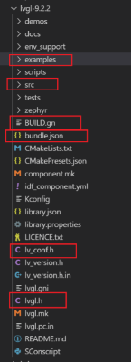

LVGL源码很多，但有用的就只是有：

| 名称               | 描述                           |
|--------------------|--------------------------------|
| `examples/`        | 存放LVGL的各种接口示例代码     |
| `src/`             | 实现LVGL核心功能的源码目录     |
| `lv_conf_template.h` | LVGL的配置文件模板             |
| `lvgl.h`           | LVGL的主头文件，包含核心声明   |
| `lv_version.h`     | 定义LVGL版本信息的头文件       |

#### 3. 添加屏幕驱动到LVGL，修改lvgl配置

打开**examples/porting/lv_port_disp_template.h** 文件,改名为**lv_port_disp.h** ，修改如下：

  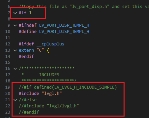

打开**examples/porting/lv_port_disp_template.c** 文件,改名为**lv_port_disp.c** ，修改如下：
    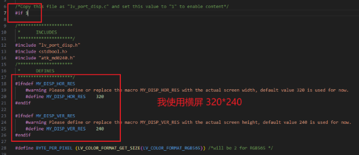
    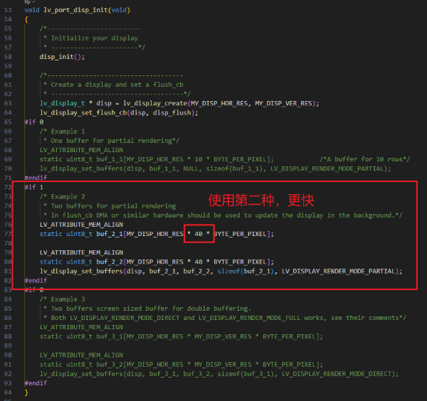
    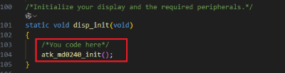
    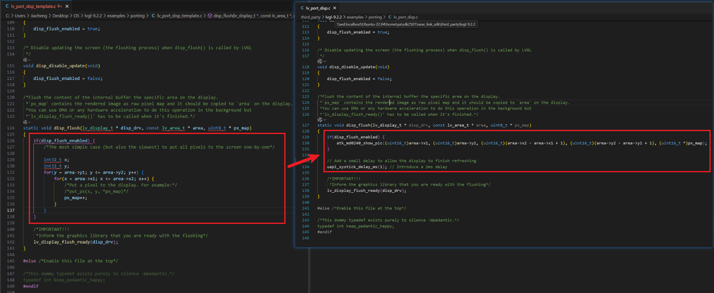

把屏幕驱动文件添加到 porting/ 文件夹中：

 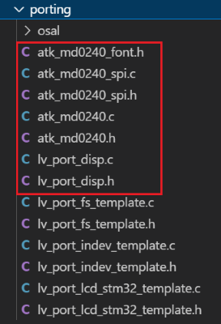

打开 lv_conf_template.h 改名为 **lv_conf.h** 文件。修改内容如下：

  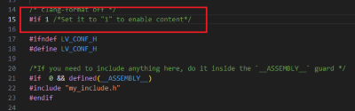
  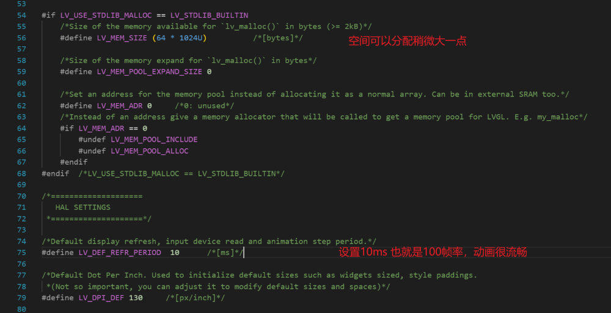

#### 4. 添加LVGL到系统编译

修改 [**BUILD.gn**](lvgl-9.2.2/BUILD.gn)  文件和 [**bundle.json**](lvgl-9.2.2/bundle.json) 文件还有 [**lvgl.gni**](lvgl-9.2.2/lvgl.gni) 文件

打开 device/soc/hisilicon/ws63v100/sdkv102/build/config/target_config/ws63/config.py 添加：

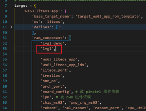

打开 device/soc/hisilicon/ws63v100/sdkv102/libs_url/ws63/cmake/ohos.cmake 添加：

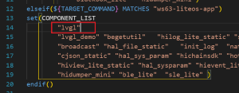


### 3. 双目屏验证

左目：创建根目录 /applications/sample/wifi-iot/app/lvgl-zuo/ 文件夹

添加 [test.c](app/lvgl-zuo/test.c) 文件 和 [BUILD.gn](app/lvgl-zuo/BUILD.gn) 文件

右目：创建根目录/applications/sample/wifi-iot/app/lvgl-you/ 文件夹

添加 [test.c](app/lvgl-you/test.c) 文件 和 [BUILD.gn](app/lvgl-you/BUILD.gn) 文件

一个屏幕编译一次，比如编译左目，步骤：
打开 applications/sample/wifi-iot/app/BUILD.gn 

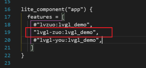

同样需要到 config.py 和 ohos.camke 中：

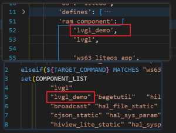

开始编译，根目录执行命令：

```bash
rm -rf out && hb set -p nearlink_dk_3863 && hb build -f
```

效果如下：


### 4. 加上3588控制

#### 预期目标

3588和ws63通过WiFi热点连接，协同构建智能AI语音助手系统。3588负责语音识别与对话处理，实时获取天气温湿度等信息，后台自动发送指令数据给ws63；ws63接收3588的指令，通过LVGL在双目屏幕上显示相应的表情反馈，实现类似流浪地球2中MOSS的智能无感交互体验。

#### 已经完成

1.  3588和人语音对话，3588实时获得天气和温湿度信息。
2.  3588根据和人的语音对话，后台向ws63发送指令。
3.  ws63根据指令画出lvgl。
4.  3588端相关代码在  [RK3588智能表情交互系统](https://gitee.com/guchaliang111/system-capability-competition)（钟文强同学制作）
5.  ws63端相关代码在本仓库中，具体操作在下文。

#### 指令包括

1.  人需要"我"（3588）表现开心，发送HAPPY指令，ws63用lvgl画出开心的眼神。如下图：

    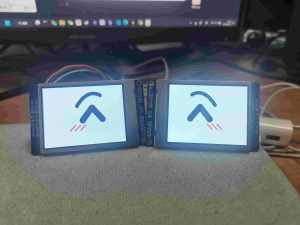

2.  人需要"我"（3588）表现哭泣，发送CRY指令，ws63用lvgl画出哭泣的眼神。如下图：

    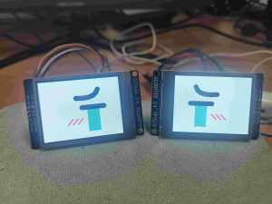

3.  人需要"我"表现悲伤，发送SAD指令，ws63用lvgl画出悲伤眼神。如下图：

    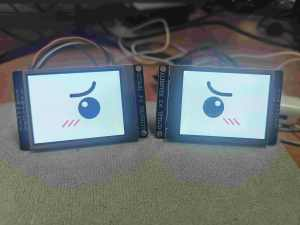

4.  人需要"我"表现害怕，发送FEAR指令，ws63用lvgl画出害怕眼神。如下图：

    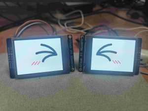

5.  人需要"我"表现惊喜，发送SURPRISED指令，ws63用lvgl画出惊喜眼神。如下图：

    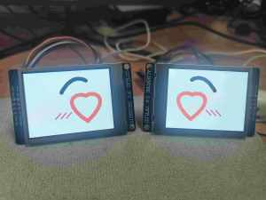

6.  人需要"我"倾听，也就是表现自然，发送OTHER指令，ws63用lvgl画出自然眼神。如下图：

    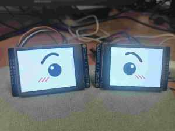

7.  人需要"我"显示天气和温湿度信息，发送WENSHIDU,TIANQI指令，ws63用lvgl画出天气和温湿度信息。(暂未完成实时数据体现) 如下图：

    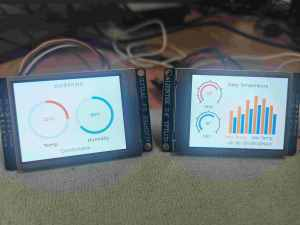
    

#### 实现步骤

1. **网络连接**  
   - ws3：参考官方 TCP Demo 连接手机热点，获取 IP，并在本地端口 `8889` 监听。  
   - 3588：连接至同一热点，向 `ws3_IP:8889` 发送控制指令。

2. **进程架构（ws3）**  **重点！！**
   - 资源受限：设备内存与 CPU 余量有限，无法承担很多的计算任务。  
多任务。  
   - 工作流：  
     1. 启动「数据接收进程」负责 TCP 监听与指令解析。  
     2. 接收到绘图指令后，创建并运行「LVGL 绘图进程」。
   - ⚠️ **特别说明**：需要先开启wifi进程，等wifi完全启动，连接好热点，再创建其他进程。

3. **绘图流程**  
   - LVGL 主循环：`while(1){ lv_timer_handler(); }` 独占绘图进程，确保渲染实时。  
   - 新指令到来：先销毁当前绘图进程，再创建新的绘图进程渲染最新表情。

4. **性能限制与取舍**  
   - 320×240 RGB565 屏幕占用显存高，复杂动画易导致内存溢出。  
   - 当前策略：仅显示静态表情，减小资源占用。  
   - 后续方向：降低分辨率、分帧动画、利用硬件加速或外扩 RAM。

#### 代码的复现步骤

1.  将app/中的emo-you 和 emo-zuo 添加到sdk的app/中，修改BUILD.gn。修改热点名称和密码为你自己的名称密码。
2.  把third_party/中的 lvgl-you 和 lvgl-zuo 替换sdk中的third_party/lvgl的相关内容。
3.  分别编译烧录左眼的代码和右眼的代码。
4.  打开热点。打开串口调试，重启板子，能看到反馈信息，如图：

    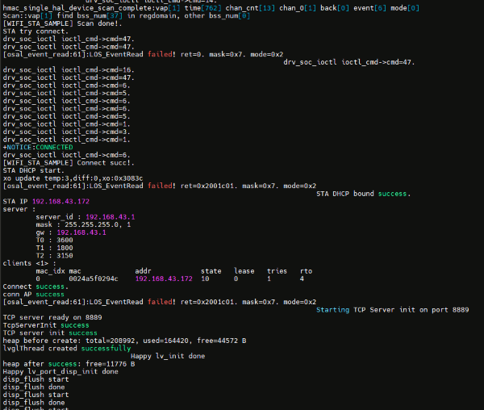

5.  这里可以通过如下方法验证数据接收和-显示效果。上图中板子ip为192.168.43.172，端口8889，电脑端下载一个tcp调试工具，给ip和端口发消息。正常应为下图所示：

    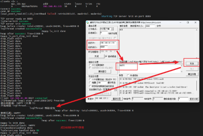


## 4. 遇到的问题和解决

请查看[遇到的问题和解决](遇到的问题和解决.md)

## 5. 项目总结

请查看[项目总结](项目总结.md)
