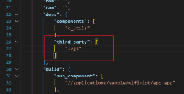
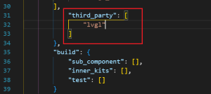

# 赛题：proj263-将LVGL库移植到OpenHarmony轻量系统

- [赛题：proj263-将LVGL库移植到OpenHarmony轻量系统](#赛题proj263-将lvgl库移植到openharmony轻量系统)
  - [目录结构](#目录结构)
  - [1. 成员介绍](#1-成员介绍)
  - [2. 赛题描述](#2-赛题描述)
  - [3. 项目开发步骤](#3-项目开发步骤)
    - [1. 开发准备](#1-开发准备)
    - [2. 移植LVGL库到OpenHarmony轻量系统](#2-移植lvgl库到openharmony轻量系统)
      - [1. 下载LVGL最新源码](#1-下载lvgl最新源码)
      - [2. 把LVGL源码解压到开发环境](#2-把lvgl源码解压到开发环境)
      - [3. 添加屏幕驱动到LVGL，修改lvgl配置](#3-添加屏幕驱动到lvgl修改lvgl配置)
      - [4. 添加LVGL到系统编译](#4-添加lvgl到系统编译)
    - [3. 双目屏验证](#3-双目屏验证)
    - [4. 加上3588控制](#4-加上3588控制)
  - [4. 遇到的问题和解决](#4-遇到的问题和解决)
  - [5. 项目总结](#5-项目总结)

## 目录结构

```bash
仓库
│  README.md             # 项目总说明
│  遇到的问题和解决.md    # 开发时遇到的一些问题
│  项目总结.md           # 项目总结
├─app                   # sdk/applications/sample/wifi-iot/app目录    
├─lvgl-9.2.2            # 可以直接放到sdk/third_party/目录下
├─图片                  # 文档需要用的图片
├─屏幕                  # 屏幕驱动相关内容
└─润和WS63              # 开发环境搭建相关内容
```

## 1. 成员介绍

- 队伍信息：

  | 学校|队伍编号|队名|赛题号|
  | --- | --- | --- | --- |
  |中国石油大学（华东）|T202510425995771 | 小石油开心队|proj263|

- 成员：

  | 姓名|身份|专业|年级|
  |---| --- | --- | --- |
  |赵家诚|队长|计算机科学与技术|本科大三2022级|
  |钟文强|队员|计算机科学与技术|本科大三2022级|
  |王家兴|队员|本研一体化班（人工智能类）|本科大一2024级|

- 参赛导师：
  1. 钟敏
  2. 成玲

## 2. 赛题描述

- 项目预期效果：
    1. 将LVGL库移植到OpenHarmony轻量系统。
    2. 在 1 的基础上，实现《"小鱼"智能AI语音助手》

- 开发环境：

  - OpenHarmony 5.0.0 轻量系统 (润和wsl-openharmony轻量系统sdk20250105)
  - LVGL 9.2.2

- 硬件选型：

  - 正点原子RK3588  一个
  - 润和WS63  两个
  - 正点原子atk-md0240 320 * 240 lcd 屏幕  两个  

## 3. 项目开发步骤

### 1. 开发准备

- ws63开发环境开发环境搭建（[开发环境搭建说明](润和WS63/README.md)）
- 改写屏幕驱动文件，使ws63能驱动屏幕。（[移植驱动说明](屏幕/README.md)）

### 2. 移植LVGL库到OpenHarmony轻量系统

#### 1. 下载LVGL最新源码

LVGL官网：[lvgl/lvgl: Embedded graphics library to create beautiful UIs for any MCU, MPU and display type.](https://github.com/lvgl/lvgl)

#### 2. 把LVGL源码解压到开发环境

解压压缩包到开发环境 third_party/lvgl-9.2.2 目录下,重要文件红框标出，需要创建BUILD.gn文件，bundle.json文件，lvgl.gni文件


LVGL源码很多，但有用的就只是有：

| 名称               | 描述                           |
|--------------------|--------------------------------|
| `examples/`        | 存放LVGL的各种接口示例代码     |
| `src/`             | 实现LVGL核心功能的源码目录     |
| `lv_conf_template.h` | LVGL的配置文件模板             |
| `lvgl.h`           | LVGL的主头文件，包含核心声明   |
| `lv_version.h`     | 定义LVGL版本信息的头文件       |

#### 3. 添加屏幕驱动到LVGL，修改lvgl配置

打开**examples/porting/lv_port_disp_template.h** 文件,改名为**lv_port_disp.h** ，修改如下：

  

打开**examples/porting/lv_port_disp_template.c** 文件,改名为**lv_port_disp.c** ，修改如下：
    
    
    
    

把屏幕驱动文件添加到 porting/ 文件夹中：

 

打开 lv_conf_template.h 改名为 **lv_conf.h** 文件。修改内容如下：

  
  

#### 4. 添加LVGL到系统编译

修改 [**BUILD.gn**](lvgl-9.2.2/BUILD.gn)  文件和 [**bundle.json**](lvgl-9.2.2/bundle.json) 文件还有 [**lvgl.gni**](lvgl-9.2.2/lvgl.gni) 文件

打开 device/soc/hisilicon/ws63v100/sdkv102/build/config/target_config/ws63/config.py 添加：


打开 device/soc/hisilicon/ws63v100/sdkv102/libs_url/ws63/cmake/ohos.cmake 添加：


打开 applications/sample/wifi-iot/app/bundle.json 添加：



打开 applications/sample/wifi-iot/bundle.json 添加：



### 3. 双目屏验证

左目：创建根目录 /applications/sample/wifi-iot/app/lvgl-zuo/ 文件夹

添加 [test.c](app/lvgl-zuo/test.c) 文件 和 [BUILD.gn](app/lvgl-zuo/BUILD.gn) 文件

右目：创建根目录/applications/sample/wifi-iot/app/lvgl-you/ 文件夹

添加 [test.c](app/lvgl-you/test.c) 文件 和 [BUILD.gn](app/lvgl-you/BUILD.gn) 文件

一个屏幕编译一次，比如编译左目，步骤：
打开 applications/sample/wifi-iot/app/BUILD.gn 


同样需要到 config.py 和 ohos.camke 中：


开始编译，根目录执行命令：

```bash
rm -rf out && hb set -p nearlink_dk_3863 && hb build -f
```

效果如下：


### 4. 加上3588控制

## 4. 遇到的问题和解决

请查看[遇到的问题和解决](遇到的问题和解决.md)

## 5. 项目总结

请查看[项目总结](项目总结.md)
