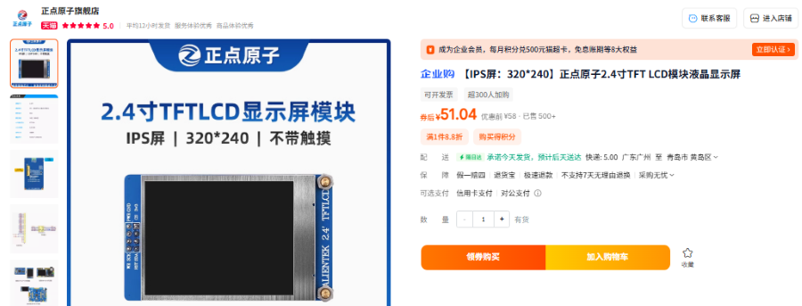
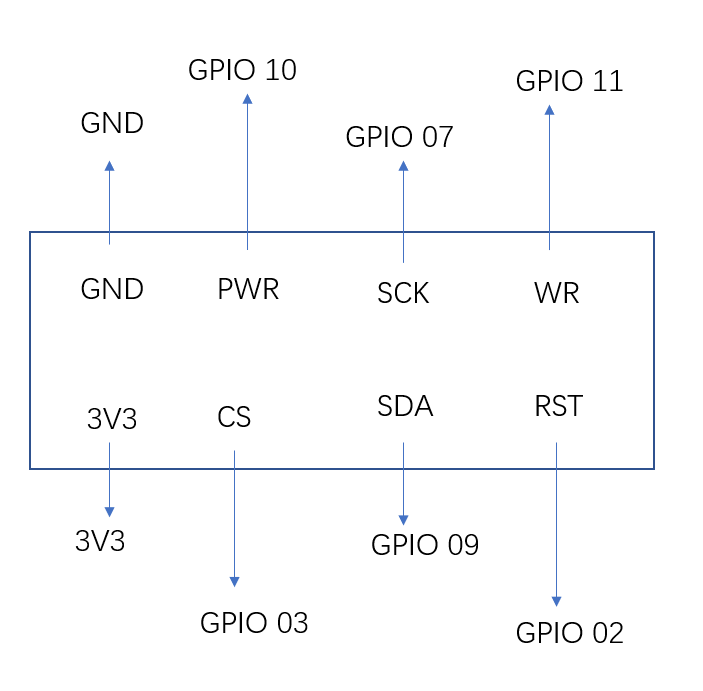
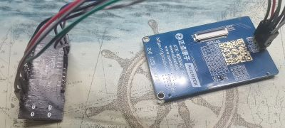
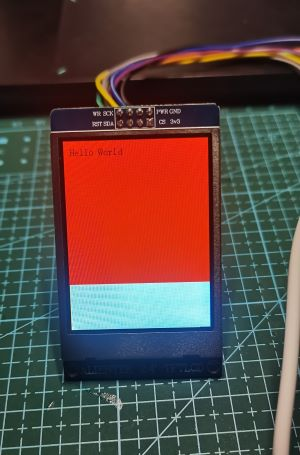

# 屏幕驱动移植

我购买的是



淘宝链接：[【IPS屏：320*240】正点原子2.4寸TFT LCD模块电容液晶显示屏-tmall.com天猫](https://detail.tmall.com/item.htm?id=768663566580&pisk=gTlzs1_zQQdrn5Z8EjNF0BkifyF8iW-6xXZQ-203PuqkpzOhT2ugRUKpyxznAmLpy7g3YDobD6aBeHCE00giF8iIFk43mm05NkO8LDusXD1BwYahTmgLKDGEJ6zn-DL8AUpjy4FLtht6TCg-yBlqGQGzrS4mkPfu-KwlUIuWlht61BJloW-yfD1hR4d07PV3rJflmEzQSMqnxJfmooUL-g4hZE84DPBhZuXlit488Wju-6Xcny4NK94ltqY4Joq3tWm3iEzKN5o-vGagEenM6oxlHFy0j4qVt1bTz8Xnz91COgUuElc3464jgzyzj4cS_fdzojG4C-_B2S0th044_QSTzx0aZylpS9rULbF40cRG9rHo4j2EGep-uXrzIb22TFgaTym3LxKN1zPS3RlreeImrcZrI73C73g4QxyTo-bFE7Ms5XeiZQSTcRUE0RMyb_oG4xSLoyYx9YShL84YulT2uI7R_DQB-KdCp9e0Irr6yJXdp84YulT2u9BLe144fUeh.&spm=tbpc.boughtlist.suborder_itemtitle.1.20652e8dPTCwgc)

## 目录结构

```bash
屏幕
├── 屏幕相关文档                            #屏幕的使用说明手册
│   ├── ATK-MD0240模块SPI接口使用说明.pdf
│   └── ATK-MD0240模块SPI接口用户手册.pdf
├── 修改后驱动文件
│   ├── atk_md0240_font.h
│   ├── atk_md0240_spi.c
│   ├── atk_md0240_spi.h
│   ├── atk_md0240.c
│   ├── atk_md0240.h
├── 原驱动文件
│   ├── atk_md0240_font.h
│   ├── atk_md0240_spi.c
│   ├── atk_md0240_spi.h
│   ├── atk_md0240.c
│   └── atk_md0240.h
└── README.md
```

以下为正点原子ATK-MD0240 240 * 320 LCD 屏幕 SPI驱动  的移植步骤：

1. 商家提供驱动文件和文档。
2. 连接引脚。
3. 修改文件。
4. 验证。
5. 修改屏幕绘图方向（竖屏或者横屏）

## 1. 商家提供驱动文件和文档

[2.4寸TFT LCD显示屏模块320 * 240 全部资料下载链接](http://47.111.11.73/docs/modules/lcd/2.4-TFTLCD.html)

## 2. 连接引脚

按图所示连接引脚，框中的是屏幕引脚名字，GPIO xx是板子引脚名字。



连接好后，是这样的：



## 3. 修改文件

正点原子提供的驱动文件为: 原驱动文件/     五个文件。请对应修改。
修改好的驱动文件在：修改后驱动文件/       五个文件。
注意：

1. spi属性中的时钟频率为主机的时钟频率，ws63驱动spi用的是ws63 的外部晶体时钟频率 24MHz 或者 40MHz（在ws63产品说明书中查找外部晶体时钟频率）
2. 建议开启dma，高帧率需要大量数据传送。
3. 使用画图函数来绘制lvgl，画点函数太慢，效果太差。但这里要注意画图函数里的数据要经过一定的处理，请在文件中对比查看。

## 4. 验证

验证文件demo.c ：

```c
#include <stdio.h>    
#include <unistd.h>  
#include "ohos_init.h"  
#include "cmsis_os2.h"  
#include "atk_md0240.h"
static void OledTask(void *arg)
{
    (void)arg;
    // 初始化atk_md0240
    atk_md0240_init();
    atk_md0240_fill(0, 0, 240, 240, ATK_MD0240_RED);
    atk_md0240_show_string(10, 10, "Hello World", ATK_MD0240_FONT_16, ATK_MD0240_BLACK);
}
static void OledDemo(void)
{
    osThreadAttr_t attr;
    attr.name = "OledTask";
    attr.attr_bits = 0U;
    attr.cb_mem = NULL;
    attr.cb_size = 0U;
    attr.stack_mem = NULL;
    attr.stack_size = 0x5000;  
    attr.priority = osPriorityNormal;
    if (osThreadNew(OledTask, NULL, &attr) == NULL) {
        printf("[OledDemo] Falied to create OledTask!\n");
    }
}
APP_FEATURE_INIT(OledDemo);
```

BUILD.gn 文件仿照相同文件。

编译烧录后，可以看到相应效果：



## 5. 修改屏幕绘图方向（竖屏或者横屏）

管理绘图方向的是 `atk_md0240_spi.c` 中 `static void atk_md0240_reg_init(void)` 函数中这两行代码：（具体解释请看 [屏幕相关文档/ATK-MD0240模块SPI接口用户手册.pdf](屏幕相关文档/ATK-MD0240模块SPI接口用户手册.pdf)）

```c
    /* Memory Data Access Control */
    atk_md0240_write_cmd(0x36);    
    atk_md0240_write_dat(0x00);
```

如果要修改为横屏，也就是绘图方向为 从上到下，从右往左，只需将atk_md0240_write_dat() 的参数调整为：

```c
    atk_md0240_write_dat(0x60);
```

如果是横屏，从上到下，从左往右，就是：

```c
    atk_md0240_write_dat(0xa0);
```
