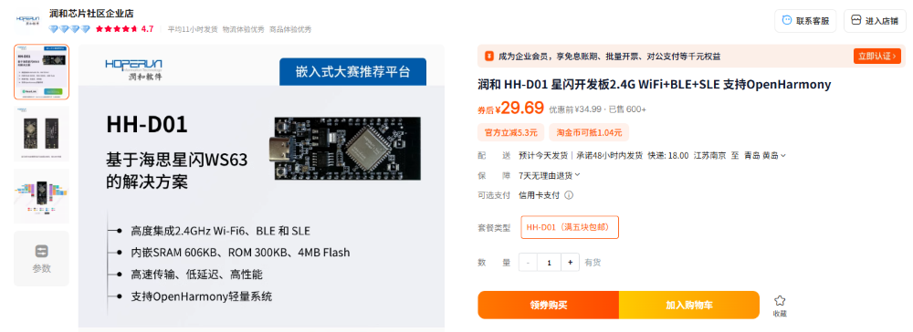
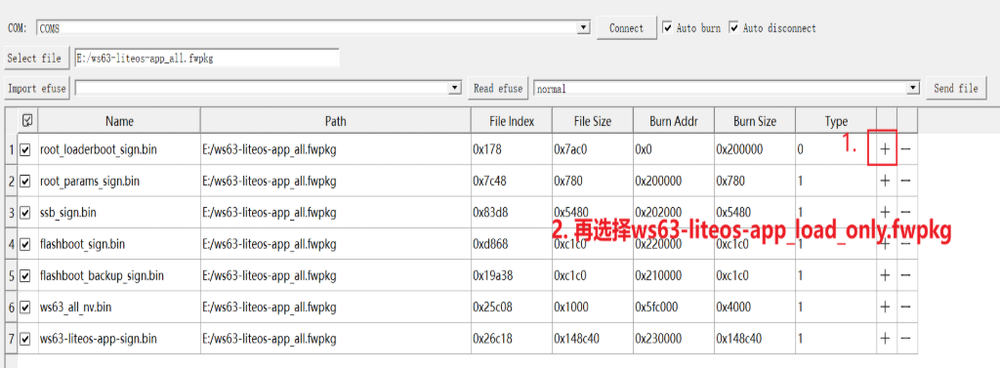
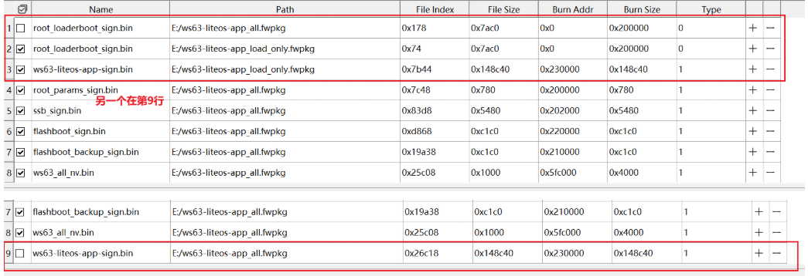

# 开发环境搭建说明

我购买的是：

淘宝链接：[润和 HH-D01 星闪开发板2.4G WiFi+BLE+SLE 支持OpenHarmony](https://item.taobao.com/item.htm?id=808095015320&pisk=guBZbLAaQReNzRT9s99q8hixhHv9CKz7btTXmijDfFYM5t_Vm3tZifADiJAH4eMbXdNv3Z8FkFO6It5K3gIAClpbXdI9HK47P8wVXGpvK4lsNOonKhsHmEA0OpqAUDW7P8w5X5x9hM45hiEFShtSnKAMiB2HJniioZAMteYpDn0MmAqUYeKjIhxDnecHqntMnxvmxMx64ExMjFAhxeKDnEbDnkJHJnDe7GjmL3OgDdSYjJ4USBYljekmU0Kws7sZGxMfxhAN4G8eOB6ebC8kiZ3hFObCmO699zukHM1PusbYNXpNm1vMVGeZLLjGOt-ChoG2SNBFx9AEVY9VsN5Dw6y-wCA276XMTmDcvK5HZs7a7fLG1wRJxBm4eH_W-GBGTo3hjaTwIHAQEuSHi669wOanQLfRfd1ck7GpQifMLgytkHcEetCZojRMvH87YkRWjxb2swjtajhvtLKePltsMjdMvH87YklxMBxJYUZ6f&spm=a21xtw.29178619.0.0&skuId=5499499996884)

## sdk选择

我使用的SDK版本是：`sdk20250105`。

开发环境：`WSL2` + `Windows 11`。

## 烧录的注意事项

烧录固件有两个，要注意

## 其他问题

请前往[海思社区](https://developers.hisilicon.com/postDetail?tid=0283176718093970007)