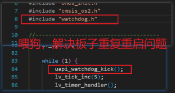
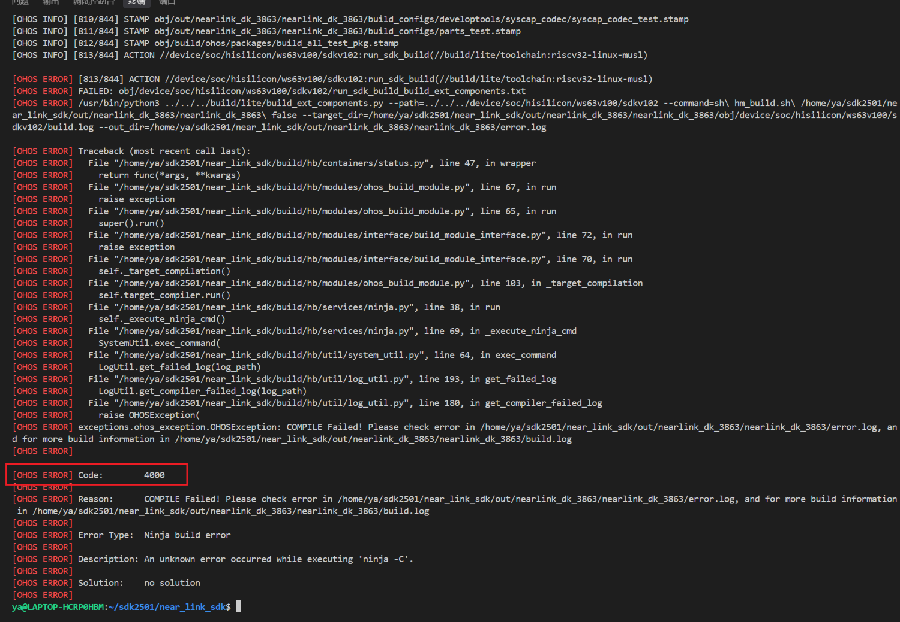
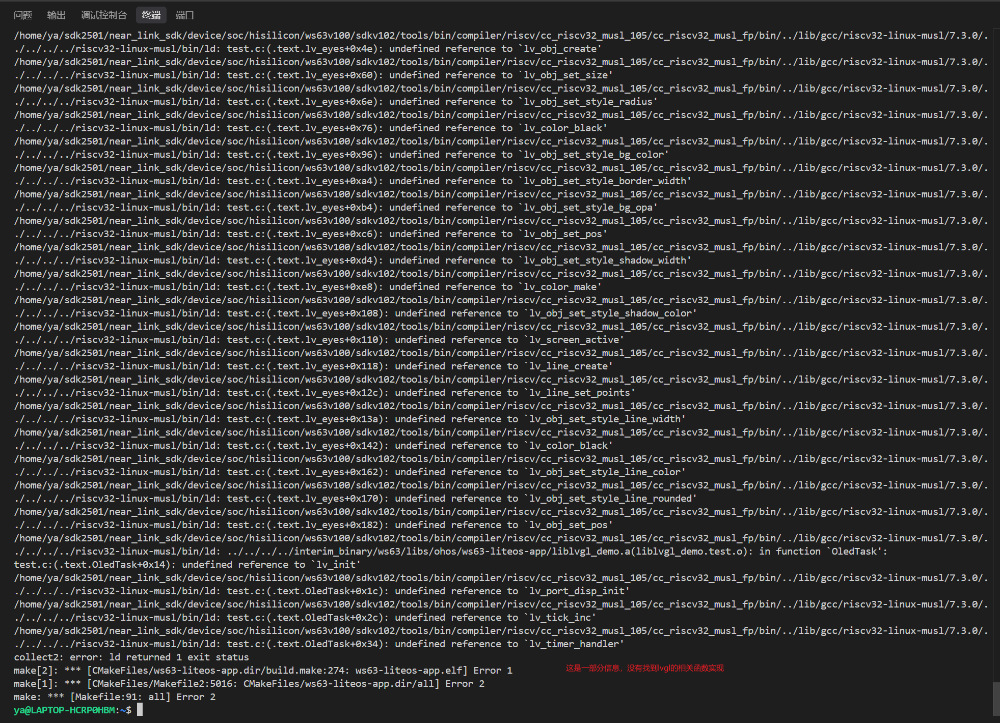
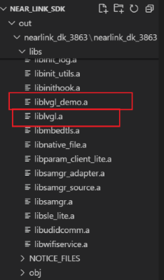
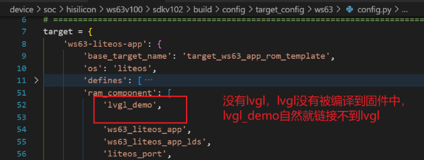
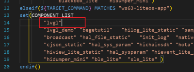
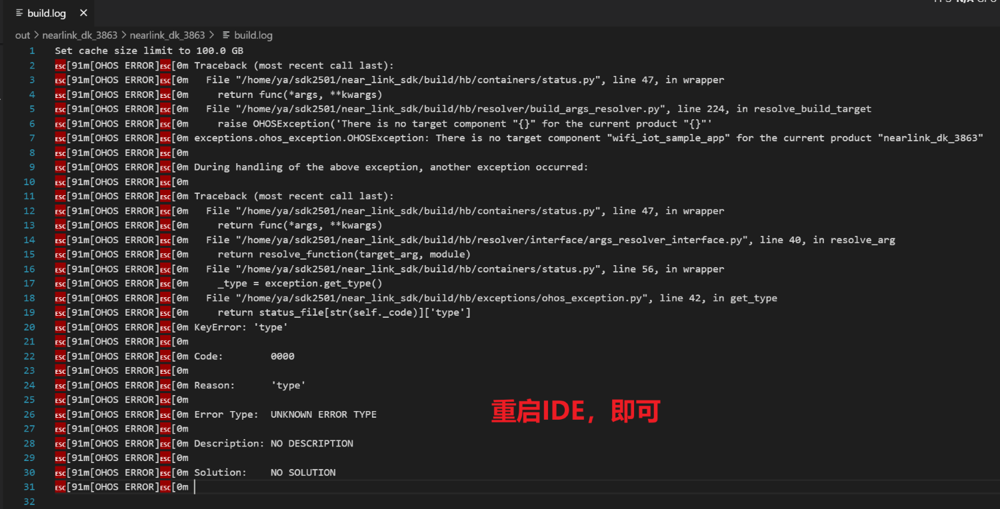

# 遇到的问题与解决

- [遇到的问题与解决](#遇到的问题与解决)
  - [1. 解决重复重启问题](#1-解决重复重启问题)
  - [2. 编译报错，如何找问题？](#2-编译报错如何找问题)
  - [3. 编译错误4000](#3-编译错误4000)
  - [4. type编译错误](#4-type编译错误)


## 1. 解决重复重启问题


## 2. 编译报错，如何找问题？

首先看报错信息，也就是build.log。

如果他报告的错误是这样的，无有用信息请看：[错误代码4000](#3-编译错误代码4000)

## 3. 编译错误4000

错误原因一般是：链接错误。就是说有函数名写错，没有在库中找到对应的实现函数；要么就是库要依赖某个库，但是没有找到对应的库。



可以执行如下命令查找到具体错误信息：
```bash
cd device/soc/hisilicon/ws63v100/sdkv102
```

```bash
python3 build.py -c ws63-liteos-app 2> ~/build_error.log
```

也就是手动执行编译脚本，把信息写到build_error.log，打开 build_error.log 文件，查看错误信息。



未找到函数定义，应该是库没有链接成功，那么lvgl库有没有被编译呢？
查看下图目录：



静态库文件编译成功，那为什么没有被链接呢？应该是没有lvgl.a库文件没有被编译到最后的烧录固件中

也就是查看

device/soc/hisilicon/ws63v100/sdkv102/build/config/target_config/ws63/config.py   的ram_component列表中有没有lvgl.a，



device/soc/hisilicon/ws63v100/sdkv102/libs_url/ws63/cmake/ohos.cmake 的COMPONENT_LIST 中有没有lvgl.a,



这里面有lvgl。

这两个文件中相应内容决定了哪些组件需要被编译并最终链接到要加载到设备 RAM 中运行的固件镜像里。两个文件中都需要写lvgl。

重新编译，即可成功。


## 4. type编译错误

