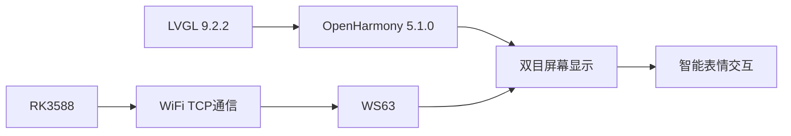
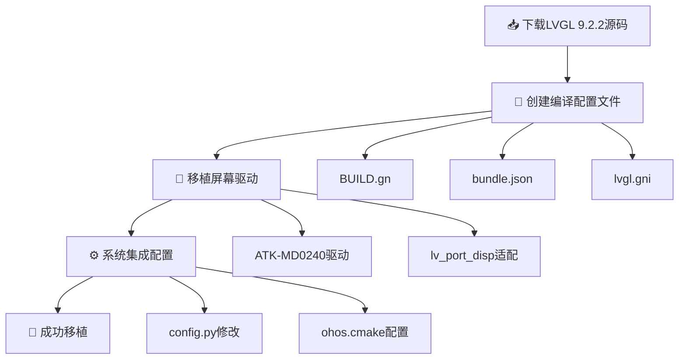
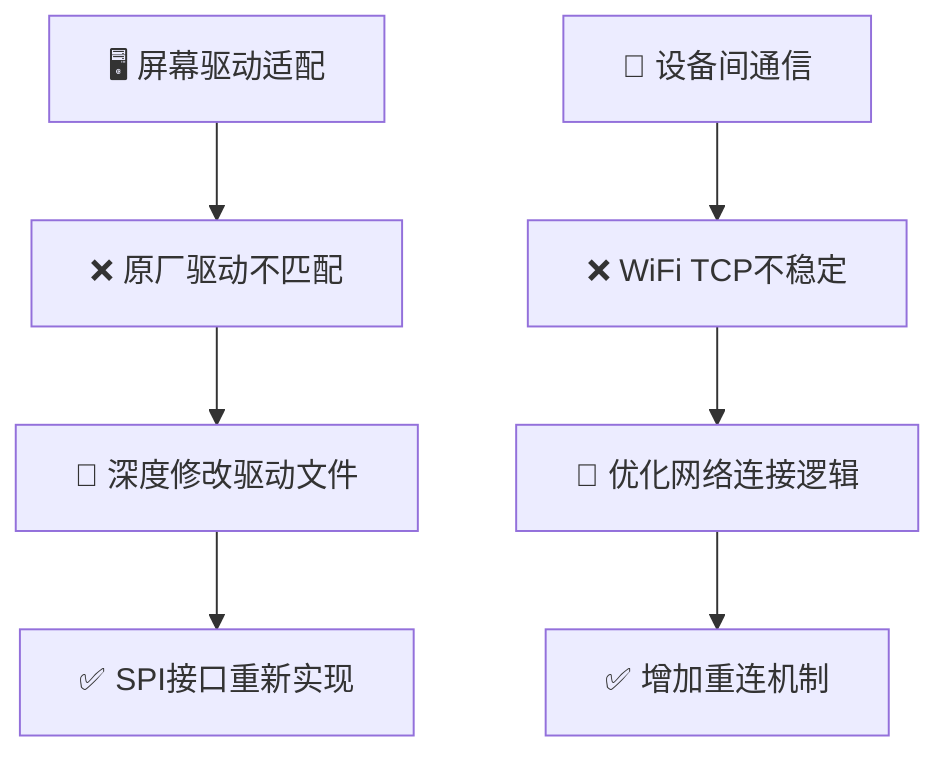
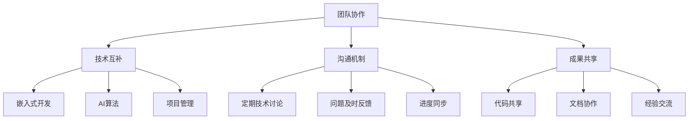
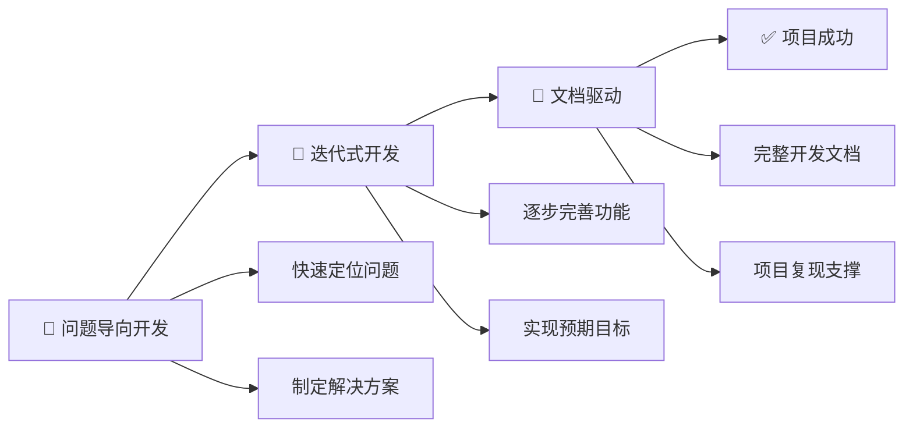
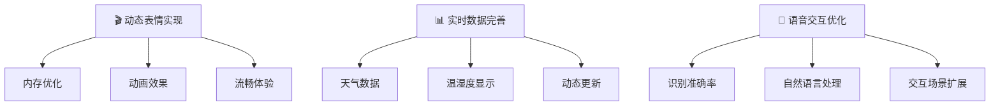
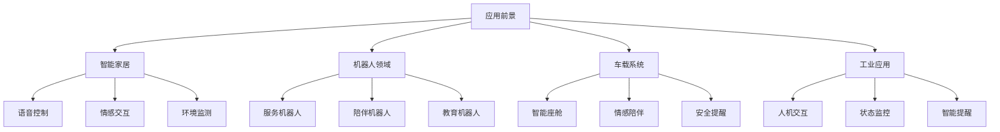

# 🚀 项目总结

> **赛题**：proj263-将LVGL库移植到OpenHarmony轻量系统  
> **团队**：小石油开心队  
> **完成时间**：2025年6月

---

## 📋 目录

- [🚀 项目总结](#-项目总结)
  - [📋 目录](#-目录)
  - [🎯 项目概述](#-项目概述)
    - [🎪 主要成就](#-主要成就)
  - [🏆 技术成果与创新点](#-技术成果与创新点)
    - [核心技术成果](#核心技术成果)
    - [系统创新点](#系统创新点)
  - [🔧 开发过程与关键技术](#-开发过程与关键技术)
    - [📈 移植技术路线](#-移植技术路线)
    - [🚀 关键技术突破](#-关键技术突破)
  - [⚡ 遇到的挑战与解决方案](#-遇到的挑战与解决方案)
    - [🔥 技术挑战](#-技术挑战)
    - [🔧 硬件挑战](#-硬件挑战)
  - [👥 团队分工与协作](#-团队分工与协作)
    - [🎯 分工明确，各有所长](#-分工明确各有所长)
    - [🤝 协作成效](#-协作成效)
  - [💡 收获与体会](#-收获与体会)
    - [🎓 技术收获](#-技术收获)
    - [📋 项目管理体会](#-项目管理体会)
    - [🤝 团队协作感悟](#-团队协作感悟)
  - [🔮 未来展望](#-未来展望)
    - [🚀 功能优化方向](#-功能优化方向)
    - [🛠️ 技术拓展方向](#️-技术拓展方向)
    - [🌟 应用前景](#-应用前景)
  - [📝 总结](#-总结)
    - [🏆 核心成就](#-核心成就)
    - [🚀 创新突破](#-创新突破)
    - [🎓 团队成长](#-团队成长)
    - [🔮 未来价值](#-未来价值)

---

## 🎯 项目概述

本项目以 **"将LVGL库移植到OpenHarmony轻量系统"** 为核心目标，在此基础上构建了一个智能AI语音助手系统。

### 🎪 主要成就

| 技术栈 | 版本/型号 | 状态 |
|--------|-----------|------|
| **图形库** | LVGL 9.2.2 | ✅ 成功移植 |
| **操作系统** | OpenHarmony 5.1.0 轻量系统 | ✅ 完全适配 |
| **主控芯片** | RK3588 + 润和WS63 | ✅ 双芯片协同 |
| **显示设备** | 320×240 双LCD屏幕 | ✅ 同步显示 |

> 💫 **项目亮点**：实现了类似《流浪地球2》中MOSS的智能无感交互体验

---

## 🏆 技术成果与创新点

### 核心技术成果



| 🎯 成果 | 📝 描述 | ⭐ 重要性 |
|---------|---------|-----------|
| **LVGL库成功移植** | 将LVGL 9.2.2库完整移植到OpenHarmony轻量系统，解决了图形库与轻量系统的兼容性问题 | ⭐⭐⭐⭐⭐ |
| **双目屏幕同步显示** | 实现320×240双LCD屏幕的同步表情显示，增强视觉表现力 | ⭐⭐⭐⭐ |
| **跨设备通信架构** | 构建了3588与WS63基于WiFi热点的TCP通信机制，实现了稳定的指令传输 | ⭐⭐⭐⭐ |

### 系统创新点

> 🚀 **创新亮点**

- **🏗️ 多进程架构设计**  
  在资源受限的轻量系统中，创新性地采用进程分离策略，将数据接收和LVGL绘图分离到不同进程，有效避免了资源冲突

- **🎭 智能表情映射**  
  建立了语音交互到视觉表情的智能映射机制，支持6种基础表情：
  ```
  😊 开心    😢 感动    😔 伤感
  😨 害怕    😲 惊喜    😐 自然
  ```

- **📊 实时数据集成**  
  集成天气和温湿度等实时数据显示功能，提升了交互体验的实用性

---

## 🔧 开发过程与关键技术

### 📈 移植技术路线



| 步骤 | 🎯 任务 | 📝 详细描述 | ✅ 状态 |
|------|---------|-------------|---------|
| **1** | **源码适配** | 下载LVGL 9.2.2源码，创建适配OpenHarmony的BUILD.gn、bundle.json等编译配置文件 | ✅ 完成 |
| **2** | **驱动集成** | 移植正点原子ATK-MD0240屏幕驱动，修改lv_port_disp相关文件实现硬件适配 | ✅ 完成 |
| **3** | **系统集成** | 修改config.py和ohos.cmake等系统配置文件，将LVGL库集成到OpenHarmony编译系统 | ✅ 完成 |

### 🚀 关键技术突破

> 💡 **核心技术创新**

| 技术点 | 🎯 问题 | 💡 解决方案 | 🏆 效果 |
|--------|---------|-------------|---------|
| **内存优化** | 轻量系统内存受限 | 调整LVGL配置参数（LV_MEM_SIZE、刷新率等） | 📈 稳定运行 |
| **进程管理** | 多进程协调复杂 | 分层启动策略：WiFi → TCP监听 → LVGL绘图 | 🎯 有序启动 |
| **资源管控** | 资源泄露风险 | 进程销毁重建机制 | ⚡ 快速响应 |

---

## ⚡ 遇到的挑战与解决方案

### 🔥 技术挑战

> 💪 **困难重重，迎难而上**

| 🚨 挑战 | 📝 问题描述 | 💡 解决方案 | 🎯 结果 |
|---------|-------------|-------------|---------|
| **内存限制** | 轻量系统内存受限，320×240 RGB565显示占用大量显存 | 优化LVGL内存配置，采用静态表情替代动态动画 | ✅ 稳定运行 |
| **编译兼容性** | LVGL与OpenHarmony编译系统的集成适配 | 深入研究OpenHarmony编译机制，编写完整的编译配置文件 | ✅ 完美集成 |
| **多进程协调** | 在资源受限环境下实现进程间协调 | 设计合理的进程启动序列和进程生命周期管理 | ✅ 有序运行 |

### 🔧 硬件挑战

> 🛠️ **硬件适配，精益求精**



| 🔧 硬件问题 | 🎯 具体表现 | 💡 解决策略 | 📈 改进效果 |
|-------------|-------------|-------------|-------------|
| **屏幕驱动适配** | 原厂驱动与OpenHarmony系统接口不匹配 | 深度修改驱动文件，重新实现SPI接口和显示接口 | 🎯 完美适配 |
| **设备间通信稳定性** | WiFi热点模式下的TCP通信稳定性问题 | 优化网络连接逻辑，增加重连机制和错误处理 | 📡 稳定通信 |

---

## 👥 团队分工与协作

### 🎯 分工明确，各有所长

> 👨‍💻 **团队成员及贡献**

| 👤 成员 | 🎭 角色 | 🔧 主要贡献 | 💪 专业技能 |
|---------|---------|-------------|-------------|
| **赵家诚** | 🏆 队长 | LVGL移植、WS63开发、屏幕驱动适配、WiFi客户端开发、进程管理、UI设计 | 嵌入式系统开发 |
| **钟文强** | 🚀 技术骨干 | 创意设计、3588端开发、语音识别、实时数据获取、人脸识别 | AI算法与语音处理 |
| **王家兴** | 📝 项目协调 | 文档管理、项目协调、确保项目文档完整性和一致性 | 项目管理与文档 |

### 🤝 协作成效



**🎯 协作亮点：**
- ✅ **技术互补**：不同专业背景形成完美互补
- ✅ **高效沟通**：定期技术讨论，及时解决难题  
- ✅ **成果共享**：代码、文档、经验全面共享
- ✅ **项目推进**：保证项目按计划顺利完成

---

## 💡 收获与体会

### 🎓 技术收获

> 📚 **知识积累，技能提升**

| 🔧 技术领域 | 📈 收获内容 | 🎯 实际应用 | ⭐ 重要程度 |
|-------------|-------------|-------------|-------------|
| **OpenHarmony系统** | 深度了解编译系统、驱动框架和系统架构 | 成功移植LVGL库 | ⭐⭐⭐⭐⭐ |
| **嵌入式图形开发** | 掌握LVGL图形库使用和优化技巧 | 资源受限环境下的GUI开发 | ⭐⭐⭐⭐ |
| **跨平台通信** | 异构设备间稳定通信实现 | 3588与WS63协同工作 | ⭐⭐⭐⭐ |

### 📋 项目管理体会



**💡 核心体会：**
- 🎯 **问题导向开发模式**：快速定位问题，高效制定解决方案
- 🔄 **迭代式开发的重要性**：逐步完善功能，最终实现预期目标
- 📝 **文档的重要性**：完整的开发文档为项目复现和后续优化提供重要支撑

### 🤝 团队协作感悟

> 👥 **团队力量，共创辉煌**

| 🎭 协作要素 | 💡 核心价值 | 🎯 实践效果 |
|-------------|-------------|-------------|
| **专业互补** | 不同专业背景成员在各领域发挥专长 | 📈 整体开发效率大幅提升 |
| **沟通协调** | 及时的技术交流和进度同步 | 🎯 项目成功的关键保障 |
| **责任分担** | 明确分工，各司其职 | ✅ 高质量完成各项任务 |

---

## 🔮 未来展望

### 🚀 功能优化方向

> 🎯 **持续改进，追求完美**



| 🎯 优化方向 | 📝 具体目标 | 🔧 实现方案 | 📈 预期效果 |
|-------------|-------------|-------------|-------------|
| **动态表情实现** | 流畅的动画表情效果 | 进一步优化内存使用，实现分帧动画 | 🎬 更生动的视觉体验 |
| **实时数据完善** | 天气温湿度数据实时更新 | 完善数据传输和动态显示功能 | 📊 更实用的信息展示 |
| **语音交互优化** | 提升交互体验 | 提升语音识别准确率，增加交互场景 | 🎤 更自然的人机对话 |

### 🛠️ 技术拓展方向

> 🔧 **技术升级，生态扩展**

| 🚀 拓展领域 | 💡 发展方向 | 🎯 目标成果 |
|-------------|-------------|-------------|
| **硬件性能提升** | 采用性能更强的硬件平台或外扩内存方案 | 💪 支持更复杂的功能 |
| **功能模块化** | 将核心功能模块化，便于在其他OpenHarmony设备上复用 | 🔄 提高代码复用性 |
| **生态扩展** | 探索与更多IoT设备的集成可能性，构建智能家居生态 | 🏠 完整的智能家居方案 |

### 🌟 应用前景

> 🔮 **前景广阔，未来可期**



**🎯 核心价值：**
- 🏠 **智能家居**：提供情感化的家居交互体验
- 🤖 **机器人应用**：为服务机器人增加情感表达能力  
- 🚗 **车载系统**：打造更人性化的智能座舱
- 🏭 **工业应用**：提升工业设备的人机交互体验

---

## 📝 总结

> 🎉 **项目圆满完成，收获满满**

### 🏆 核心成就

本项目 **成功实现了LVGL库在OpenHarmony轻量系统上的移植**，并构建了具有实际应用价值的 **智能AI语音助手系统**。

### 🚀 创新突破

| 🎯 突破领域 | 💡 创新点 | 🏆 价值 |
|-------------|-----------|---------|
| **系统架构** | 多进程分离设计 | 🔧 资源优化利用 |
| **跨设备通信** | 稳定的TCP通信机制 | 📡 可靠的数据传输 |
| **资源优化** | 轻量系统下的图形渲染 | ⚡ 高效的性能表现 |

### 🎓 团队成长

通过这个项目，团队成员在 **嵌入式开发**、**系统集成**、**项目管理** 等方面都获得了宝贵的经验，为未来在相关领域的深入发展奠定了坚实基础。

### 🔮 未来价值

项目展示了OpenHarmony轻量系统在智能交互领域的应用潜力，为后续在智能家居、机器人、车载系统等领域的应用提供了技术基础和实践经验。通过持续优化和功能扩展，有望发展成为一个完整的智能交互解决方案。

---
